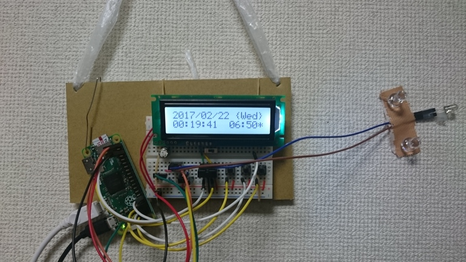

# AirAlarm

## 概要

__「寒い冬、朝起きるときに暖房がついていたらいいな」__という想いを形にしました。

Raspberry Pi Zero に以下の機能を実装しました。

- 設定時刻にエアコンの電源ON
- 現在時刻、温度、湿度、大気圧をLCDに表示(バックライトは自動点灯/消灯）

また、REST API 経由で以下の操作ができます。

- 現在の温度、湿度、大気圧の取得
- エアコンをONにする時刻の設定
- 基本的なエアコン操作(ON/OFF, 設定温度および風量の変更)

## 回路図

Raspberry Pi Zero のピンアサイン（参考）:
http://i0.wp.com/daisuke-ogura.ciao.jp/wp-content/uploads/2016/04/Zero_pin1.jpg

## 必要なもの

- Raspberry Pi Zero
- キャラクタLCD ACM1602NI-FLW-FBW-M01
- 半固定抵抗(10kΩ)
- 温湿度センサ BME280
- 照度センサ TSL2561
- 赤外線LED OSI5LA5113A
- 赤外線受光モジュール PL-IRM2161-XD1
- MOSFET 2SK4150TZ-E x2
- 抵抗(10kΩ x2, 20Ω x1)
- LED光拡散キャップ

その他、SDカード、Micro USBケーブル、ブレッドボード、ジャンパワイヤなど

## インストール

0. ダウンロード
   `git clone https://github.com/eggplant60/airalarm.git`

1. ライブラリのインストール
	`sudo apt-get install python.rpi.gpio i2c-tools python-smbus apache2`

2. I2Cの有効化
   参考: http://yura2.hateblo.jp/entry/2016/02/13/Raspberry_Pi%E3%81%AB%E6%8E%A5%E7%B6%9A%E3%81%97%E3%81%9FLCD(ACM1602NI)%E3%82%92Python%E3%81%A7%E5%8B%95%E3%81%8B%E3%81%99

3. Webアプリの設定

4. Supervisorへの登録

## 参考URL
