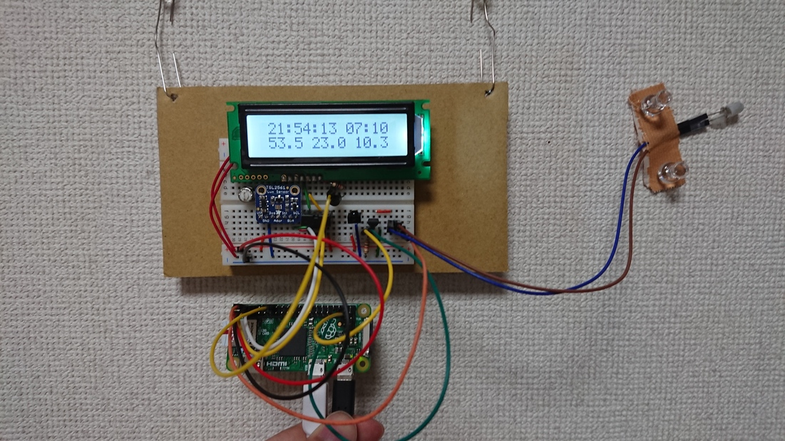

# AirAlarm

## 概要

**「寒い冬、朝起きるときに暖房がついていたらいいな」**という想いを形にしました。

Raspberry Pi Zero に以下の機能を実装しました。

- 設定した時刻に、エアコンの電源を入れる
- 時刻設定等はWebアプリで行う
- 現在時刻、温度/湿度、照度をLCDに表示する(バックライトの自動点灯/消灯機能つき）

## 回路図

Raspberry Pi Zero のピンアサイン（参考）:
http://i0.wp.com/daisuke-ogura.ciao.jp/wp-content/uploads/2016/04/Zero_pin1.jpg

## 必要なもの

- Raspberry Pi Zero
- キャラクタLCD ACM1602NI-FLW-FBW-M01
- 10kΩの半固定抵抗
- 温湿度センサAM2320
- 照度センサTSL2561モジュール

その他、SDカード、Micro USBケーブル、ブレッドボード、ジャンパワイヤなど

## インストール

0. ダウンロード
   `git clone https://github.com/eggplant60/airalarm.git`

1. ライブラリのインストール
	`sudo apt-get install python.rpi.gpio i2c-tools python-smbus apache2`

2. I2Cの有効化
   参考: http://yura2.hateblo.jp/entry/2016/02/13/Raspberry_Pi%E3%81%AB%E6%8E%A5%E7%B6%9A%E3%81%97%E3%81%9FLCD(ACM1602NI)%E3%82%92Python%E3%81%A7%E5%8B%95%E3%81%8B%E3%81%99

3. Webアプリの設定

4. Supervisorへの登録

## 参考URL

-
